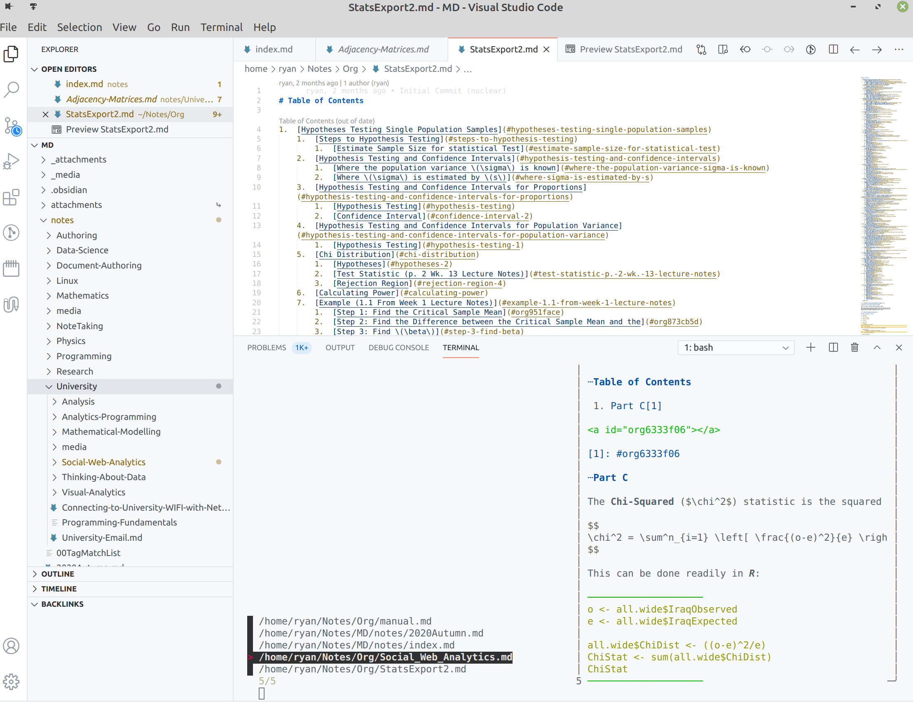

# Use Recoll to search
An easy way to search for notes with Recoll

## Requirements
* Skim
  * I use this instead of fzf because it has an interactive mode, although I
    have been unable to get that to work though.
* MDCat
  * I use this instead of glow, highlight or bcat, because it looks better and because it supports images (although the images don't work through `skim`)
* Kitty (Recommended)
    * Makes the markdown preview the best, if on Mac, iTerm2 is another option.
        * I'm not sure if Alacritty would work well with MDCat?
        
## Installation        

```bash
mkdir -p ~/DotFiles/Note-Taking-Tools

git clone https://github.com/RyanGreenup/Note-Taking-Tools ~/DotFiles/Note-Taking-Tools
cd ~/DotFiles/Note-Taking-Tools
stow -t $HOME -S -Taking-Tools/Terminal-Skim-Recoll
```


## Usage

This will work in the terminal and or in VSCode, I'm a big Vim/Emacs fan but I do find this most convenient to use in VSCode

0. Create a Recoll Database of just your notes
1. Open your notes folder in VSCode
2. Press <kbd>Ctrl+`</kbd> to open the termina
3. Type `ns.sh` and press Enter
4. Provide a search Query and press Enter
5. filter through the matches by typing and scroll the right-side preview with <kbd>Page Up</kbd> / <kbd>Page  Down</kbd>

### RipGrep

Alternatively it is possible to use ripgrep instead of recoll by running `nr.sh`, I just [copy pasted that from here](https://github.com/lotabout/skim#as-interactive-interface)



