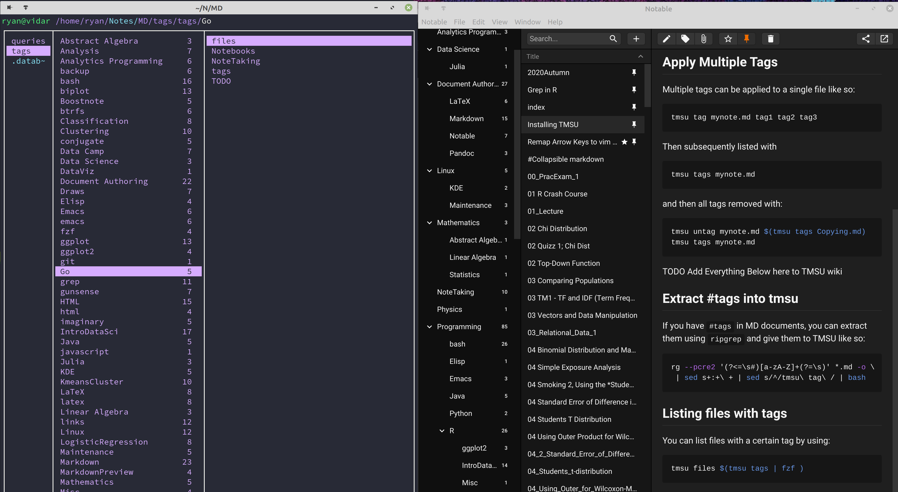

# Import tags to TMSU

> [Home](../README.md)

This collection of scripts will take tags from your MD notes and pass them to *TMSU* so they be useful outside of any particular app.

Currently this works for:

* YAML tags (think Notable and WikiJS ) 
    * Currently WikiJS tags are broken, [see this issue here](https://github.com/Requarks/wiki/issues/1997)
* `#tags` (think Zettlr and Obsidian) 
* There is no support for `:tags:` like Vimwiki, this shouldn't be hard to implement though.
    * I wonder if that would also work for `org-mode` files? 🤔


This screenshot provides an example of how this works:



## Requirements

* **_R_** <sup>(I'm on v 4.0, I don't know if that matters)</sup>
  * [Tidyverse](https://cran.r-project.org/web/packages/tidyverse/index.html)
      * [See there website](https://www.tidyverse.org/)
  * [RMarkdown](https://cran.r-project.org/web/packages/rmarkdown/index.html)
* [ripgrep](https://github.com/BurntSushi/ripgrep)
* [TMSU](https://tmsu.org/) <sup> [AUR](https://aur.archlinux.org/packages/tmsu/) </sup>
* [GNU Stow](https://www.gnu.org/software/stow/) is recommended

### MD Files

* Syntactically correct file names
    * no `()#!/\` or whitespace characters
        * WikiJS uses `-` instead of space so I use that, as opposed to `_`
    * TODO surround the file names in the **_R_**-*Script* with `''` to hide whitespace from the shell
* Tags are not logical operators
    * don't have tags that are `and`, `or` or `not`

## Installation

### GNU Stow

Just do this:

```
mkdir -p ~/DotFiles/Note-Taking-Tools
git clone https://github.com/RyanGreenup/Note-Taking-Tools ~/DotFiles/Note-Taking-Tools
cd ~/DotFiles/Note-Taking-Tools
stow -t $HOME -S tags-to-TMSU
```


## How to use

### Automated Script

You can use this from an automatic script, but, but in the unlikely
scenario where there is *dangerous* text inside your tags (e.g. `rm -rf` or
`chown -R`) this may cause grief so be careful, I'd probably recommend
using the individual scripts manually as described below.

To use the script just call it with the notes directory as the argument,
alternatively call it in the same location as the notes.

```bash
tags-to-TMSU.sh ~/Notes/MD/notes
```
> Choose option `n` at first to initialize the *TMSU* Repo

Choose the tags you'd like generated and then after they've generated mount the tmsu database with:

```bash
cd ~/Notes/MD/notes
mkdir ../tags
tmsu mount ../tags
```
and unmount with

```bash
tmsu umount ../tags
## fusermount -uz ../tags ## If the above fails
```

## Running the Scripts Manually (Recommended)

### Installing Manually

Copy the following files into `~/bin`:

* `./bin/YamltoTMSU.R`
* `./bin/hashtags.sh`
* `./bin/tags-to-TMSU.sh`

### Initialize TMSU

First go to your notes directory and initialise a tmsu database with `tmsu init`.

### `#`tags

In order to pass`#tags` to *TMSU* run the following (assuming `~/bin` is in your PATH):

```bash
cd ~/Notes/MD/notes
hashtags.sh

## Alternatively
## hashtags.sh /path/to/notes
```
After reviewing the output, pipe it into `bash`/`zsh`:

```bash
cd ~/Notes/MD/notes
hashtags.sh | bash
```

### *YAML* Tags

In order to pass `YAML` tags to *TMSU* use the **_R_***-*Script*:

```bash
Rscript ~/bin/YamltoTMSU.R ~/Notes/MD/notes
cat /tmp/00tags.csv
```

After reviewing the output pipe it into bash:

```bash
Rscript ~/bin/YamltoTMSU.R ~/Notes/MD/notes
cat /tmp/00tags.csv | bash
```


